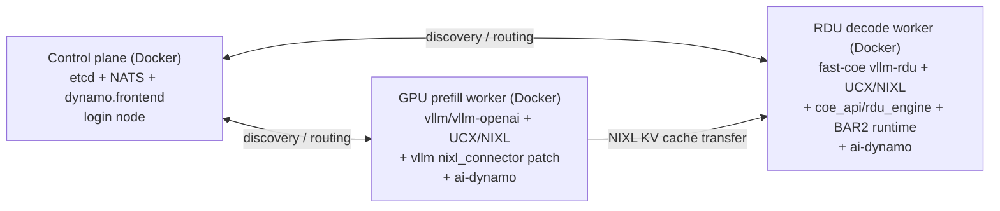

# rdu-hdi — GPU Prefill + RDU Decode via Dynamo

Disaggregated inference on SambaNova hardware: H200 GPU handles prefill,
SN40L RDU handles decode, coordinated by NVIDIA Dynamo.

---

## Architecture



`coe_api`/BAR2 runtime connector libs are self-built from a pinned commit of SambaNova's software
repo and baked directly into the RDU Docker image (`build/bar2.sh`, pin in
`config/versions.env`).

Both sides install plain `ai-dynamo`/`ai-dynamo-runtime`, never the `[vllm]` extra — that extra
pulls in vllm 0.20.x as a dependency, which breaks MiniMax-M2.7 (both sides pin vllm 0.16.0
instead, for different reasons — see `config/versions.env`).

All external dependencies are pinned to exact commit SHAs in `config/versions.env`.

---

## Scripts

| Script | Purpose |
|--------|---------|
| `build/rdu_env.sh` | Fetch/build fast-coe, UCX, NIXL, and the vllm+cpu wheel (RDU side) |
| `build/bar2.sh` | Self-build coe_api/rdu_engine + the BAR2 runtime connector libs |
| `docker/gpu/build.sh` | Build + push the GPU prefill Docker image |
| `docker/control-plane/build.sh` | Build + push the control-plane Docker image |
| `docker/rdu/build.sh` | Build + push the RDU decode Docker image |
| `launch/control_plane.sh` | Launch (or `--stop`) the control-plane container |
| `launch/gpu_prefill.sh` | Launch the GPU prefill worker |
| `launch/rdu_decode.sh` | Launch the RDU decode worker (submits its own `snrdu` job) |
| `bench/run.sh` | Run one benchmark config |
| `bench/sweep.sh` | Run the standard 9-config benchmark sweep |
| `bench/*.py` | Per-request profiling/tracing tools (PNG timeline, cluster-wide Chrome Trace) — see `bench/README.md` |
| `test/e2e_rdu_decode.sh` | End-to-end smoke test of the RDU decode image |
| `test/e2e_kv_routing.py` | E2E test proving KV-cache-aware + load-aware prefill routing is actually active (not just configured) against a live stack |

---

## Configuration

Two config files to edit before use:

**`config/cluster.env`** — cluster topology (nodes, IPs, reservations, Docker image tag)
```bash
GPU_NODES=(sc3-c129)        # your GPU node(s) — one entry per prefill worker
GPU_RESERVATIONS=(my-res)   # index-paired with GPU_NODES; "" omits --reservation
GPU_ROCE_IP=10.17.176.33    # GPU node RoCE IP
RDU_NODE=sc3-s339           # your RDU node
RDU_ROCE_IP=10.17.112.29    # RDU node RoCE IP
...
```

**`config/model.env`** — model/PEF paths and inference settings
```bash
MODEL=/path/to/checkpoints/MyModel
SERVED_MODEL_NAME=MyModel
PEF=/path/to/my-model.pef
TENSOR_PARALLEL_SIZE=4
MAX_MODEL_LEN=196608
...
```

---

## Prerequisites

- Login node access (`sc-vnc9` or equivalent) with `snrdu` on PATH
- SSH key access to GitHub (for cloning the private `sambanova/fast-coe` repo)
- `sudo -g docker` access on GPU nodes (for `cuda-docker-run-wrapper`)
- GPU node reservation + RDU node reservation (see `config/cluster.env`)

## One-time setup

```bash
git clone https://github.com/andychensn/rdu-hdi.git && cd rdu-hdi
REPO=$(pwd)

# Edit config for your cluster + model before continuing
vi config/cluster.env config/model.env

source config/versions.env
source config/cluster.env
source config/model.env

# 1. Fetch benchmark tooling
git clone https://github.com/SemiAnalysisAI/InferenceX.git "$REPO/InferenceX"
git -C "$REPO/InferenceX" checkout "$INFERENCEX_COMMIT"

# 2. Build GPU prefill Docker image (~20 min, login node, no GPU required)
bash docker/gpu/build.sh

# 3. Fetch fast-coe source and build UCX/NIXL + the +cpu vllm wheel from
#    source — all in one script, two phases (login node needs internet;
#    RDU-node build takes ~5 min total).
bash build/rdu_env.sh --fetch-only
snrdu run -sp "$RDU_PARTITION" --qos "$RDU_QOS" --nodelist "$RDU_NODE" \
    --allow-local-lib-python --reservation "$RDU_RESERVATION" \
    --pef "$PEF" --timeout "$RDU_TIMEOUT" -o logs/build_rdu_env.log \
    -- bash build/rdu_env.sh --build-only

# 4. Self-build coe_api/rdu_engine + the BAR2 runtime connector libs (required
#    by docker/rdu/build.sh below) — same two-phase pattern.
bash build/bar2.sh --fetch-only
snrdu run -sp "$RDU_PARTITION" --qos "$RDU_QOS" --nodelist "$RDU_NODE" \
    --allow-local-lib-python --reservation "$RDU_RESERVATION" \
    --pef "$PEF" --timeout "$RDU_TIMEOUT" -o logs/build_bar2.log \
    -- bash build/bar2.sh --build-only
```

---

## Per-session launch

All three components (control plane, GPU prefill, RDU decode) run as Docker containers.
Build the images once:

```bash
bash docker/control-plane/build.sh   # -> $CONTROL_PLANE_IMAGE (config/cluster.env)
bash docker/gpu/build.sh             # -> $GPU_IMAGE (config/cluster.env)
bash docker/rdu/build.sh             # -> $RDU_IMAGE (config/cluster.env) — bakes in
                                      #    self-built coe_api/rdu_engine + BAR2 runtime
                                      #    connector libs (build/bar2.sh)
```

Then launch, in order:

```bash
# 1. Control plane — etcd + NATS + dynamo.frontend in one container, --net=host on the login node
source config/cluster.env
bash launch/control_plane.sh &   # persistent; backgrounded

# 2. GPU prefill (~10 min: model load + warmup)
bash launch/gpu_prefill.sh

# 3. RDU decode — submits its own snrdu job (same self-dispatching shape as
#    launch/gpu_prefill.sh) and waits for it to register. Run this only
#    after step 2 has already registered (see warning below) — this script
#    does not check GPU status itself, it just launches and waits on its
#    own ~12-14 min BAR2/PEF init.
source config/model.env
bash launch/rdu_decode.sh

# 4. Warmup (first request ~47s, cold NIXL init)
curl -s http://localhost:18000/v1/completions \
    -H "Content-Type: application/json" \
    -d "{\"model\":\"$SERVED_MODEL_NAME\",\"prompt\":\"hello\",\"max_tokens\":1}"
```

> Do not start RDU decode before GPU prefill — Dynamo builds the wrong pipeline.

## Benchmark

```bash
bash bench/run.sh --input-len 1000 --output-len 1000 --concurrency 1
```

Results saved to `benchmark_results/` (gitignored). To run the standard 9-config sweep (ISL
1k/10k/100k × concurrency 1/2/4) against a given endpoint in one shot:

```bash
bash bench/sweep.sh --label my_run [--endpoint http://HOST:PORT] [--model NAME]
```

See `docs/PERFORMANCE.md` for the latest full sweep results and which commit they were measured against.

## Teardown

```bash
# Control plane: stop the container (started with --rm, so it self-removes)
bash launch/control_plane.sh --stop

# GPU prefill + RDU decode: cancel their SLURM jobs
scancel $(squeue -u $USER -h -o '%i')
```

---

## Docker

Three wrappers on the cluster:

| Wrapper | Where | Supports |
|---------|-------|---------|
| `/usr/bin/docker-wrapper` | Login node | build, push, pull, ps, … (not `run`) |
| `/usr/bin/cuda-docker-run-wrapper` | GPU nodes | run only (GPU passthrough + `/import`,`/scratch` auto-mount) |
| `/usr/bin/docker-run-wrapper` | RDU nodes | run only (`/import`,`/scratch` auto-mount; device passthrough and RDMA still need explicit flags — see `test/e2e_rdu_decode.sh`) |

All three require `sudo -g docker` (via `sudo -g docker /usr/bin/<wrapper>`). Internal registry:
`sc-artifacts2.sambanovasystems.com/sw-docker-scratch/`. `--net=host` required on both GPU and RDU
nodes (for RoCE RDMA). Containers run as non-root — default any writable-path config to `/tmp/...`
unless proven otherwise.

---

## NFS dependencies

The only genuinely external assets this stack reads from a network filesystem at runtime are:

1. **The model checkpoint** — split across two paths for the two sides: `MODEL` (`config/model.env`,
   `/import/...`) is read by GPU prefill and by RDU decode's tokenizer/config path (RDU loads
   weights with `--load-format dummy`, it doesn't read tensor data from here); `MINI_CKPT_FP8`
   (`config/minimax_m2.yaml`, `/scratch/...`) is the actual weight source the RDU engine loads.
2. **The PEF** — `PEF` (`config/model.env`, `/import/...`) and the identical path embedded as
   `MINI_PEF_FP8` in `config/minimax_m2.yaml`.
3. **`BRCM_ROCELIB`** (`/import/it-tools/idc/fw/brcm/237/bcm_237.1.148.0a/drivers_linux/bnxt_rocelib`)
   — build-time only, staged into the build context and `COPY`'d into `docker/gpu/Dockerfile`; never
   referenced at container runtime.

Two more `/import` reads exist but are repo-owned, not external dependencies: `MODEL_CONFIG`
(`config/minimax_m2.yaml`, tracked in this repo) and GPU prefill's cache dirs (`.gpu_cache/`,
gitignored scratch space). Both are reachable only because `cuda-docker-run-wrapper`/
`docker-run-wrapper` auto-mount `/import`/`/scratch` with no explicit `-v` flags anywhere in
`launch/gpu_prefill.sh` or `launch/rdu_decode.sh` — worth re-checking if this stack is
ever deployed somewhere without that auto-mount convention (e.g. a future k8s deploy).

## Known gaps

`patches/` is split by which side each override applies to — `patches/gpu/` (used by `docker/gpu/Dockerfile`) and `patches/rdu/` (used by `build/rdu_env.sh`). Both a full-file overlay (`.py`, copied wholesale) and a unified diff (`.patch`, applied via `patch -p1`) can appear on either side; the extension tells you which. These exist here, rather than as commits on a branch, only because vllm and ai-dynamo are third-party packages this repo doesn't control a fork of — for internal repos we do control (like `SambaNova/software`, see `config/versions.env`'s `SOFTWARE_REPO_*`), changes are pushed as a real branch/commit and pinned directly, not carried as a local patch file.

GPU side (`docker/gpu/Dockerfile`, `patches/gpu/`):
- **vllm nixl_connector patch**: `REGISTER_CONSUMER_MSG` not in stock vllm 0.16.0 — fixed by overlaying `patches/gpu/nixl_connector.py`, sourced from `sambanova/sn_vllm`.
- **dynamo.vllm protocol patch**: `ai-dynamo 1.2.1` imports `MultiModalUUIDDict` from vllm (added in 0.20.x). Patched inline in `docker/gpu/Dockerfile` to be conditional (same fix as the RDU side below, implemented independently rather than sharing a file — keep both in sync by hand if this logic ever changes).

RDU side (`build/rdu_env.sh`, `patches/rdu/`):
- **dynamo.vllm protocol patch**: same `MultiModalUUIDDict` gap as above, applied here via `patches/rdu/dynamo_multimodal_protocol.patch`. The RDU side does *not* need the `REGISTER_CONSUMER_MSG` patch — `VLLM_PD_CHUNK_OVERLAP` is hardcoded to `0` in `docker/rdu/entrypoint.sh` and `launch/gpu_prefill.sh`, so the feature it enables is never used.
- **RDU torch compat**: s339 has `torch 2.2.0+sn`; vllm 0.16.0 uses torch 2.4+ APIs. Two files patched by `build/rdu_env.sh`, one of them (`patches/rdu/vllm_env_override_torch22x.py`) a full-file replacement of vllm's own `env_override.py`. Long-term fix: RDU Docker image with matching torch.
- **rdma-core devel headers**: s339 ships `libibverbs`/`librdmacm` runtime `.so.1` but not the `-devel` headers, and there's no package-manager access to install them. `build/rdu_env.sh --fetch-only` downloads a pinned, SHA256-verified header subset instead of searching the filesystem for them.

## Component repos

| Repo | Access | Purpose |
|------|--------|---------|
| [`andychensn/ucx`](https://github.com/andychensn/ucx) | public | UCX 1.22 + SN RDMA patches (used by both GPU and RDU sides) |
| [`andychensn/nixl`](https://github.com/andychensn/nixl) | public | NIXL + SN UCX integration |
| [`sambanova/fast-coe`](https://github.com/sambanova/fast-coe) | private, SSH key required | vllm-rdu connector/engine (`server/vllm-rdu`), pinned by commit in `config/versions.env` |
| [`sambanova/sn_vllm`](https://github.com/sambanova/sn_vllm) | private | Source of the GPU-side `REGISTER_CONSUMER_MSG` producer file |
| [`SambaNova/software`](https://github.sambanovasystems.com/SambaNova/software) | private, internal GitHub Enterprise (`github.sambanovasystems.com`) | `coe_api`/`rdu_engine` + BAR2 runtime connector libs, self-built by `build/bar2.sh` from `SOFTWARE_REPO_COMMIT` (`config/versions.env`) |
| [`SemiAnalysisAI/InferenceX`](https://github.com/SemiAnalysisAI/InferenceX) | public | Benchmark tool (`benchmark_serving.py`), pinned via `INFERENCEX_COMMIT` |

**Non-git external dependencies**, also pinned in `config/versions.env`:

| Dependency | Source | Purpose |
|---|---|---|
| `rhel810-dev:latest` | `artifacts.sambanovasystems.com/sw-docker/` (internal Artifactory) | RDU decode's base image — brings `/opt/sambanova`'s `torch==2.2.0+sn` along |
| `vllm/vllm-openai:0.16.0` | Docker Hub (public) | GPU prefill's base image |
| `sambanova-deps-brcm-roce-userland-233.0.152.2-1.el8` | internal Artifactory `[tools]` repo (unauthenticated, via `rhel810-dev`'s own repo config) | the bnxt_re RDMA userland fix (see "RDU decode — notes" below) |
| etcd 3.5.15, NATS 2.14.3 | GitHub Releases (public), SHA256-verified | control plane binaries |

## What can't be reproduced from this repo alone

Everything listed above is pinned and self-contained — but a few things this stack depends on live
entirely outside this repo's control, with no version pin or drift detection possible:

- **The PEF** (`PEF` in `config/model.env`) — a compiled SambaNova execution graph for one specific
  model topology (MiniMax-M2.7, TP16, specific dynamic-dims ranges). Produced by a separate PEF
  compilation pipeline this repo has no part of; swapping models requires someone to already have a
  working PEF for it.
- **The FP8 checkpoint** (`MINI_CKPT_FP8` in `config/minimax_m2.yaml`) — SambaNova's packed/quantized
  weight format, produced by a separate conversion pipeline, not built or versioned here.
- **The PEF and checkpoint paths are personal scratch space**, not a shared or versioned location
  (`PEF` sits under `/import/ml-sc-scratch4/jayr/...`). If that engineer's scratch space is ever
  cleaned up, the path breaks with no warning and no repo-level way to detect it in advance.
- **The RDU kernel driver and `/dev/rdu*` device nodes** — bare-metal-only by nature (`rdu_driver.ko`
  plus the `snd.service` device-management daemon must already be running on any node this deploys
  to). No container can bring this along; it's a one-time per-physical-host provisioning concern,
  like a GPU driver.
- **`BRCM_ROCELIB`'s tarball** (Broadcom's OOT `libbnxt_re` source, GPU side) — IT-distributed, not
  pinned to a git commit or package registry. If the file at `/import/it-tools/idc/fw/brcm/...` ever
  changes or moves, there's no automated way to detect it; the fallback is "contact IT."
- **Access gates with no public fallback**: SSH key access to `github.com` (private `fast-coe`) and
  `github.sambanovasystems.com` (private `software` repo) are both hard requirements — anyone without
  both cannot reproduce the RDU-side build at all, only read this repo's own code.
- **Cluster-specific topology** (`config/cluster.env`) — node names, RoCE IPs, and SLURM
  partition/QOS/reservation names are specific to this cluster's current allocation and need
  hand-editing on any other cluster (see "Configuration" above).

## GPU prefill — notes

Key non-obvious fixes baked into the image:

1. **`--shm-size=1g`**: Docker's default 64MB `/dev/shm` is exhausted by UCX's IB transport when allocating receive descriptor pools (~4MB × 4 TP workers). Without this, UCX fails with `uct_mem.c:482 Assertion mem.memh != UCT_MEM_HANDLE_NULL`.

2. **Broadcom OOT `libbnxt_re`**: Ubuntu's inbox `libbnxt_re-rdmav34.so` sends wrong UVERBS attributes to the host's Broadcom OOT bnxt_re kernel driver (237.1.137.0), causing `EINVAL`. Fixed by building from source: `/import/it-tools/idc/fw/brcm/237/bcm_237.1.148.0a/drivers_linux/bnxt_rocelib/libbnxt_re-237.1.137.0.tar.gz` (shipped with `rc-compat/v39` for Ubuntu 22.04 compatibility).

3. **`--pull=always`**: Without this, GPU nodes use a stale cached image and don't get Dockerfile updates.

## RDU decode — notes

Key non-obvious fixes baked into the image (`docker/rdu/Dockerfile`, `docker/rdu/entrypoint.sh`):

1. **SambaNova's `bnxt_re` RDMA provider replacement**: RDU nodes deliberately disable the stock
   rdma-core `bnxt_re` userspace provider in favor of a SambaNova-supplied one — a different bug
   than the GPU side's Broadcom OOT issue above, but the same symptom class (`UCX ERROR no usable
   transports/devices`). `rhel810-dev` (this image's base) doesn't have it installed, but does have
   the repo config to `dnf install sambanova-deps-brcm-roce-userland` directly (pinned in
   `config/versions.env`'s `BRCM_ROCE_USERLAND_VERSION`) — the same RPM that provisions real
   bare-metal RDU nodes. That package's own postinstall script has a real gap (it swaps the driver
   registration file back into place but not the `.so` itself), so `docker/rdu/Dockerfile` finishes
   the swap with one explicit `cp` after the `dnf install`.
2. **`coe_api`/BAR2 runtime connector libs are baked in** (self-built, see `build/bar2.sh`
   and the architecture note above). `rdu_engine`'s compiled extension also transitively needs
   `libmpi.so.12` and a few abseil/circllhist libs — these ship inside `rhel810-dev` under
   `/opt/sambanova/lib` but aren't on the default `LD_LIBRARY_PATH`; `docker/rdu/Dockerfile` adds
   that directory explicitly.
